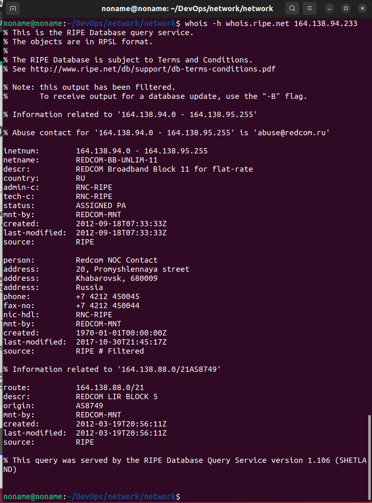
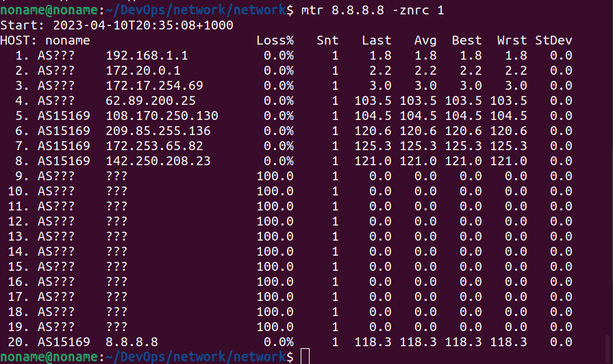

1. **Работа c HTTP через telnet.**
      
    
    
    Возвращает код 403 - страница не найдена
      
2. **Повторите задание 1 в браузере, используя консоль разработчика F12**

    Первый ответ HTTP-сервера показывает, что происходит редирект с http на https:

   
   
   Дольше всего обрабатывается запрос загрузки скрипта:
   
   
   
3. **Какой IP-адрес у вас в интернете?**

   164.138.94.233
   
4. **Какому провайдеру принадлежит ваш IP-адрес? Какой автономной системе AS? Воспользуйтесь утилитой whois.**

  
  
5. **Через какие сети проходит пакет, отправленный с вашего компьютера на адрес 8.8.8.8? Через какие AS? Воспользуйтесь утилитой traceroute.**

   
   
6. **Повторите задание 5 в утилите mtr. На каком участке наибольшая задержка — delay?**

    Наибольшая задержка на 7 хопе:
    
    
    
7. **Какие DNS-сервера отвечают за доменное имя dns.google? Какие A-записи? Воспользуйтесь утилитой dig.**

    
    
8. **Проверьте PTR записи для IP-адресов из задания 7. Какое доменное имя привязано к IP? Воспользуйтесь утилитой dig.**

    
    
    
