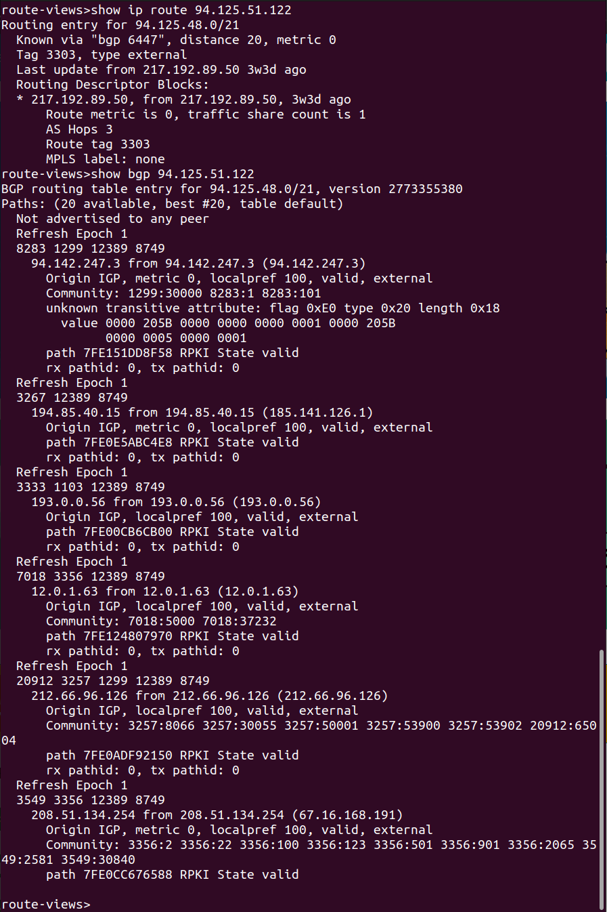
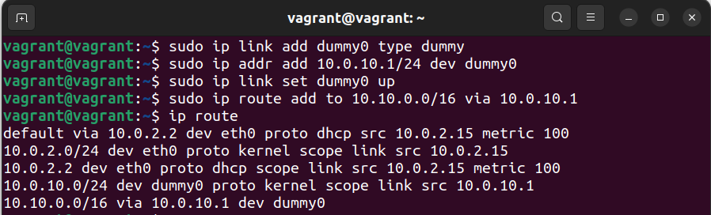
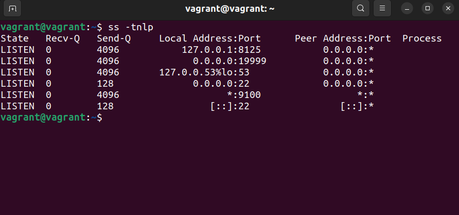
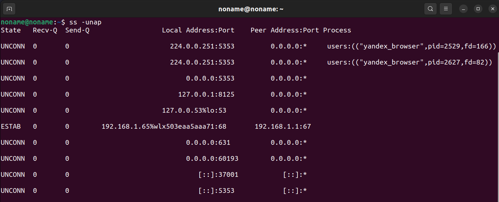
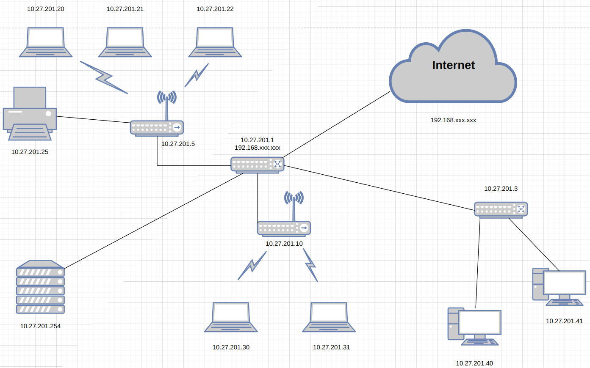

1. **Подключитесь к публичному маршрутизатору в интернет. Найдите маршрут к вашему публичному IP.**

   
   
2. **Создайте dummy-интерфейс в Ubuntu. Добавьте несколько статических маршрутов. Проверьте таблицу маршрутизации.**

   
   
3. **Проверьте открытые TCP-порты в Ubuntu. Какие протоколы и приложения используют эти порты? Приведите несколько примеров.**

   
   
   :53 - DNS;
   :22 - SSH;
   
4. **Проверьте используемые UDP-сокеты в Ubuntu. Какие протоколы и приложения используют эти порты?**

   
   
   :53 - DNS;
   :5353 - yandex_browser;
   
5. **Используя diagrams.net, создайте L3-диаграмму вашей домашней сети или любой другой сети, с которой вы работали.**

   
